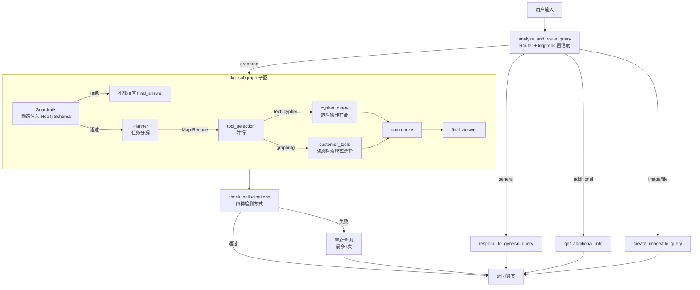
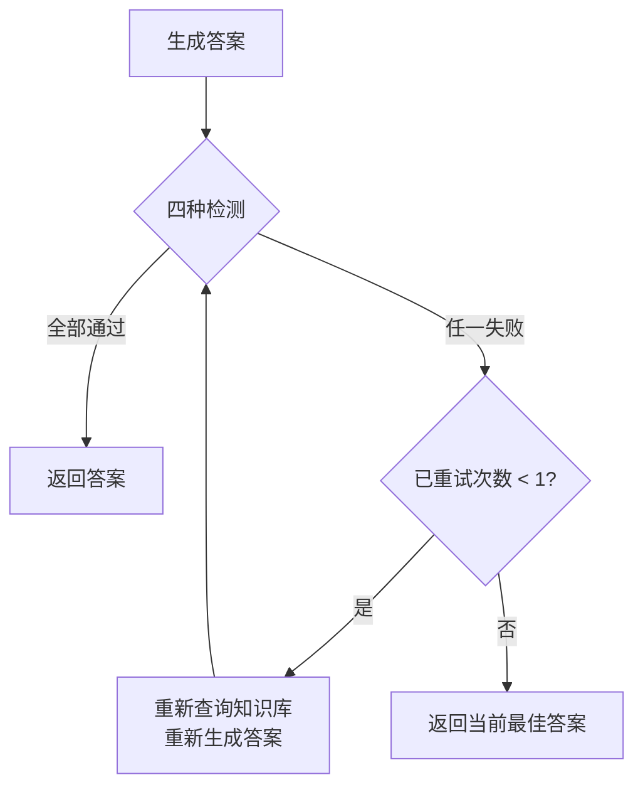

# 设计文档：智能客服 Agent 系统补全修复

## 概述

本文档描述对现有 LangGraph 多 Agent 智能客服系统的 8 处核心逻辑缺失的补全方案。系统已有完整的骨架代码，本次修复在最小化改动的前提下，逐一补全各缺失模块，使系统达到生产可用状态。

核心修复范围：
- Router 节点 few-shot 示例与 logprobs 置信度计算
- GraphRAG 路径安全护栏覆盖
- Planner + 多工具子图接入主图
- Text2Cypher 危险操作权限控制
- 幻觉检测节点接入主图（四种检测方式）
- GraphRAG 四种检索路径动态选择
- 双 Neo4j 实例架构与 Schema 缓存

---

## 架构

### 整体数据流



### 修复点与文件映射

| 修复项 | 涉及文件 | 改动类型 |
|--------|----------|----------|
| Router few-shot + logprobs | `lg_prompts.py`, `lg_builder.py` | 修改 |
| GraphRAG 路径护栏 | `lg_builder.py`, `multi_tool.py` | 修改 |
| Planner + 子图接入主图 | `lg_builder.py` | 修改 |
| Text2Cypher 权限控制 | `cypher_tools/node.py` | 修改 |
| 幻觉检测接入主图 | `lg_builder.py`, `lg_states.py` | 修改 |
| GraphRAG 动态检索模式 | `customer_tools/node.py` | 修改 |
| 双 Neo4j 实例 + Schema 缓存 | `kg_neo4j_conn.py`, `config.py` | 修改 |

---

## 组件与接口

### 修复 1：Router 节点 Few-shot 示例与 Logprobs 置信度

**修改文件：** `lg_prompts.py`、`lg_builder.py`

#### Few-shot 示例设计

在 `ROUTER_SYSTEM_PROMPT` 中补充覆盖三类的示例：

```
示例（general）：
  用户：你好
  分类：general，原因：纯粹问候

示例（additional）：
  用户：帮我查一下
  分类：additional，原因：问题不完整，需要追问

示例（graphrag）：
  用户：你们的产品有哪些功能？
  分类：graphrag，原因：业务相关问题，需要查询知识库
```

#### Logprobs 置信度计算

DeepSeek API 支持 `logprobs=True` 参数返回 token 对数概率。置信度计算流程：

```
1. 调用 model.ainvoke() 时传入 logprobs=True
2. 从响应的 response_metadata 中提取 logprobs
3. 取分类 token 的 logprob 值（通常为负数）
4. sigmoid 归一化：confidence = 1 / (1 + exp(-logprob))
5. 若 confidence < 0.6，强制将 type 改为 "graphrag"
```

**接口变更：** `analyze_and_route_query` 函数内部逻辑变更，对外接口不变。

---

### 修复 2：GraphRAG 路径安全护栏

**修改文件：** `lg_builder.py`

当前 `create_research_plan` 直接查询 GraphRAG，跳过护栏。修复后，graphrag 路径通过子图调用，子图内部已包含 Guardrails 节点（`multi_tool.py` 中已实现）。

关键点：
- `create_guardrails_node` 接受 `graph` 参数，动态注入 Neo4j Schema
- 护栏判断结果为 `"end"` 时，子图直接返回礼貌拒答，不进入 Planner
- Neo4j 连接失败时，护栏允许通过（降级处理）

---

### 修复 3：Planner + 多工具子图接入主图

**修改文件：** `lg_builder.py`

#### 子图创建（应用启动时执行一次）

```python
# 在 lg_builder.py 顶部，StateGraph 构建之前
_kg_subgraph = create_multi_tool_workflow(
    llm=_create_deepseek_model(tags=["kg_subgraph"]),
    graph=get_neo4j_graph(),          # 结构化 Neo4j
    tool_schemas=[...],               # 工具 schema 列表
    predefined_cypher_dict={},        # 预定义 Cypher（可为空）
    cypher_example_retriever=NorthwindCypherRetriever(),
    scope_description="电商客服业务范围",
)
```

#### 主图节点替换

将原来的 `create_research_plan` 节点替换为调用子图的包装函数：

```python
async def invoke_kg_subgraph(state: AgentState, *, config: RunnableConfig):
    """将主图 AgentState 转换为子图 InputState，调用子图，提取答案"""
    question = state.messages[-1].content
    chat_history = _format_chat_history(state.messages[:-1])
    
    subgraph_input = {"question": question, "chat_history": chat_history, "data": [], "history": []}
    result = await _kg_subgraph.ainvoke(subgraph_input, config=config)
    
    answer = result.get("answer", "")
    return {"messages": [AIMessage(content=answer)]}
```

#### 状态映射

| 主图 AgentState | 子图 InputState |
|----------------|----------------|
| `messages[-1].content` | `question` |
| `_format_chat_history(messages[:-1])` | `chat_history` |
| — | `data: []` |
| — | `history: []` |

子图输出 `OutputState.answer` → 写入主图 `AgentState.messages`。

---

### 修复 4：Text2Cypher 危险操作权限控制

**修改文件：** `cypher_tools/node.py`

注意：`cypher_tools/utils.py` 中已存在 `validate_no_writes_in_cypher_query` 函数，但 `cypher_tools/node.py` 中的 `cypher_query` 节点在 Cypher 生成后、执行前没有调用此函数。

修复方案：在 `cypher_query` 节点的生成步骤之后、执行步骤之前，显式调用权限检查：

```python
# 在 cypher_generation 之后，validate_cypher 之前插入
from app.lg_agent.kg_sub_graph.agentic_rag_agents.components.cypher_tools.utils import validate_no_writes_in_cypher_query

write_errors = validate_no_writes_in_cypher_query(generated_cypher)
if write_errors:
    return {
        "cyphers": [CypherQueryOutputState(
            task=state.get("task", ""),
            query=query,
            statement=generated_cypher,
            errors=write_errors,
            records={"result": "该操作涉及数据库写入，已被系统拦截。"},
            steps=["permission_denied"],
        )],
        "steps": ["permission_denied"],
    }
```

危险关键词集合（大小写不敏感）：`DELETE`、`DROP`、`MERGE`、`REMOVE`、`SET`、`CREATE`、`FOREACH`、`DETACH DELETE`。

---

### 修复 5：幻觉检测节点接入主图与四种检测方式

**修改文件：** `lg_builder.py`、`lg_states.py`

#### 状态扩展

在 `AgentState` 中增加字段：

```python
documents: str = field(default_factory=str)       # 检索到的原始上下文
hallucination_retry: int = field(default=0)        # 已重试次数
```

#### 四种检测方式实现

**方式 1：知识溯源（difflib 相似度）**
```python
import difflib
similarity = difflib.SequenceMatcher(None, answer, context).ratio()
# 阈值：similarity < 0.1 且 answer 长度 > 50 时标记为可疑
```

**方式 2：数值一致性（正则表达式）**
```python
import re
# 提取答案和上下文中的数值
nums_answer = set(re.findall(r'\d+\.?\d*', answer))
nums_context = set(re.findall(r'\d+\.?\d*', context))
# 答案中有数值但上下文中完全没有 → 可疑
```

**方式 3：实体存在性（规则关键词匹配）**
```python
# 提取答案中的中文名词短语（2-8字的连续中文字符）
entities = re.findall(r'[\u4e00-\u9fa5]{2,8}', answer)
# 检查关键实体是否出现在上下文中
missing = [e for e in entities[:10] if e not in context]
# 超过 50% 的实体缺失 → 可疑
```

**方式 4：LLM 辅助校验（deepseek-reasoner）**
```python
# 使用现有的 CHECK_HALLUCINATIONS prompt + deepseek-reasoner
model = _create_deepseek_model(tags=["hallucinations"], model_name="deepseek-reasoner")
response = await model.with_structured_output(GradeHallucinations).ainvoke(messages)
```

#### 检测流程与自我修正



#### 主图接入

```python
# 在 StateGraph 中注册
builder.add_node("check_hallucinations", check_hallucinations)

# graphrag 路径：子图完成后 → 幻觉检测 → END
builder.add_conditional_edges("invoke_kg_subgraph", route_after_text_with_hallucination)
```

---

### 修复 6：GraphRAG 四种检索路径动态选择

**修改文件：** `customer_tools/node.py`

在 `GraphRAGAPI.query_graphrag` 方法中，调用底层 API 之前动态选择 `query_type`：

```python
def _select_query_type(self, query: str, chat_history: str = "") -> str:
    """根据问题特征动态选择 GraphRAG 检索模式"""
    # drift：有对话历史且含指代词
    anaphora = ["它", "这个", "那个", "上面", "刚才", "之前", "该", "此"]
    if chat_history and any(w in query for w in anaphora):
        return "drift"
    
    # global：归纳总结类
    global_keywords = ["都有什么", "有哪些", "总结", "概述", "列举", "所有", "全部"]
    if any(kw in query for kw in global_keywords):
        return "global"
    
    # basic：短句或纯关键词（无动词，长度 < 10）
    if len(query.strip()) < 10 and not any(c in query for c in ["吗", "呢", "？", "?"]):
        return "basic"
    
    # 默认：local（实体相关）
    return "local"
```

`query_graphrag` 方法接受可选的 `chat_history` 参数，调用前先执行 `_select_query_type`。

---

### 修复 7：双 Neo4j 实例架构与 Schema 缓存

**修改文件：** `config.py`、`kg_neo4j_conn.py`

#### config.py 新增配置

```python
# 第二个 Neo4j 实例（非结构化文档知识图谱）
NEO4J_UNSTRUCTURED_URL: str = "bolt://localhost:7688"
NEO4J_UNSTRUCTURED_USERNAME: str = "neo4j"
NEO4J_UNSTRUCTURED_PASSWORD: str = "password"
NEO4J_UNSTRUCTURED_DATABASE: str = "neo4j"
```

同时在 `SETTINGS_META` 中追加对应的 UI 管理条目。

#### kg_neo4j_conn.py 新增函数与缓存

```python
import functools
import time

# Schema 缓存：TTL 60 秒
_schema_cache: dict = {}
_schema_cache_time: dict = {}
SCHEMA_CACHE_TTL = 60  # 秒

def get_neo4j_unstructured_graph() -> Optional[Neo4jGraph]:
    """返回第二个 Neo4j 实例连接（非结构化知识图谱）"""
    if not settings.NEO4J_UNSTRUCTURED_URL:
        logger.warning("NEO4J_UNSTRUCTURED_URL 未配置，跳过非结构化 Neo4j 连接")
        return None
    return Neo4jGraph(
        url=settings.NEO4J_UNSTRUCTURED_URL,
        username=settings.NEO4J_UNSTRUCTURED_USERNAME,
        password=settings.NEO4J_UNSTRUCTURED_PASSWORD,
        database=settings.NEO4J_UNSTRUCTURED_DATABASE,
    )

def get_neo4j_schema_cached(graph_key: str = "structured") -> str:
    """获取 Neo4j Schema，带 60 秒 TTL 缓存"""
    now = time.time()
    if graph_key in _schema_cache and (now - _schema_cache_time.get(graph_key, 0)) < SCHEMA_CACHE_TTL:
        return _schema_cache[graph_key]
    
    graph = get_neo4j_graph() if graph_key == "structured" else get_neo4j_unstructured_graph()
    if graph is None:
        return ""
    schema = retrieve_and_parse_schema_from_graph_for_prompts(graph)
    _schema_cache[graph_key] = schema
    _schema_cache_time[graph_key] = now
    return schema
```

---

## 数据模型

### AgentState 扩展（lg_states.py）

```python
@dataclass(kw_only=True)
class AgentState(InputState):
    router: Router = field(default_factory=lambda: Router(type="general", logic=""))
    steps: list[str] = field(default_factory=list)
    question: str = field(default_factory=str)
    answer: str = field(default_factory=str)
    hallucination: GradeHallucinations = field(default_factory=lambda: GradeHallucinations(binary_score="0"))
    need_image_gen: bool = field(default=False)
    generated_image: str = field(default_factory=str)
    # 新增字段（修复 5）
    documents: str = field(default_factory=str)        # 检索到的原始上下文，供幻觉检测使用
    hallucination_retry: int = field(default=0)         # 幻觉检测重试计数器
```

### 路由置信度结构（新增，lg_states.py）

```python
class RouterWithConfidence(TypedDict):
    """带置信度的路由结果"""
    logic: str
    type: Literal["general", "additional", "graphrag", "image", "file"]
    question: str
    confidence: float   # sigmoid 归一化后的置信度，0.0 ~ 1.0
```

### 配置新增字段（config.py Settings 类）

```python
# 第二个 Neo4j 实例
NEO4J_UNSTRUCTURED_URL: str = ""
NEO4J_UNSTRUCTURED_USERNAME: str = "neo4j"
NEO4J_UNSTRUCTURED_PASSWORD: str = "password"
NEO4J_UNSTRUCTURED_DATABASE: str = "neo4j"
```

---

## 正确性属性

*属性（Property）是在系统所有有效执行中都应成立的特征或行为——本质上是对系统应该做什么的形式化陈述。属性是人类可读规范与机器可验证正确性保证之间的桥梁。*


### 属性 1：Logprobs 置信度计算与降级逻辑

*对于任意* logprob 值（负数），sigmoid 归一化计算结果应在 [0, 1] 范围内；当计算结果 < 0.6 时，路由类型必须被强制改为 `"graphrag"`；当计算结果 >= 0.6 时，路由类型保持原始分类结果不变。

**验证：需求 1.2、1.3**

---

### 属性 2：护栏决策与路由行为一致性

*对于任意* 用户问题，护栏节点的决策结果（`"end"` 或 `"planner"`）必须与实际路由行为完全一致：决策为 `"end"` 时工作流终止并返回拒答，决策为 `"planner"` 时工作流继续进入 Planner 节点。

**验证：需求 2.2、2.3**

---

### 属性 3：Text2Cypher 危险操作拦截完整性

*对于任意* Cypher 语句，若语句（大小写不敏感）包含 `DELETE`、`DROP`、`MERGE`、`REMOVE`、`SET`、`CREATE`、`FOREACH` 中的任意一个关键词，`validate_no_writes_in_cypher_query` 必须返回非空错误列表；若语句仅包含 `MATCH`、`RETURN`、`WITH`、`WHERE`、`ORDER BY`、`LIMIT` 等只读操作，必须返回空列表。

**验证：需求 4.1、4.2、4.3**

---

### 属性 4：幻觉检测重试上限保证

*对于任意* 初始重试次数 `hallucination_retry >= 1` 的状态，幻觉检测节点不得再次触发自我修正循环，必须直接返回当前最佳答案；重试次数从 0 开始，最多执行 1 次重试后必须终止。

**验证：需求 5.6、5.7、5.8**

---

### 属性 5：GraphRAG 检索模式选择正确性

*对于任意* 查询字符串和对话历史组合，`_select_query_type` 函数的返回值必须满足以下规则（优先级从高到低）：
1. 含指代词且历史非空 → `"drift"`
2. 含归纳关键词 → `"global"`
3. 长度 < 10 且无疑问词 → `"basic"`
4. 其他情况 → `"local"`

*对于任意* 满足多个条件的查询，优先级规则必须一致地应用。

**验证：需求 6.1、6.2、6.3、6.4**

---

### 属性 6：Schema 缓存幂等性与 TTL 刷新

*对于任意* 在 60 秒 TTL 内的连续两次 `get_neo4j_schema_cached` 调用，第二次调用必须返回与第一次相同的缓存值，且不触发新的 Neo4j 连接；TTL 过期后的调用必须重新获取 Schema 并更新缓存。

**验证：需求 7.3、7.4**

---

## 错误处理

### 各修复点的错误处理策略

| 场景 | 错误类型 | 处理方式 |
|------|----------|----------|
| Logprobs API 不支持 | `KeyError` / `AttributeError` | 捕获异常，使用结构化输出原始结果，记录 warning 日志 |
| Neo4j 连接失败（护栏） | `Exception` | 允许通过，记录 warning 日志，降级处理 |
| 子图调用失败 | `Exception` | 捕获异常，返回通用错误消息，记录 error 日志 |
| Cypher 危险操作拦截 | 主动拦截 | 返回明确的权限拒绝消息，不抛出异常 |
| 幻觉检测 LLM 调用失败 | `Exception` | 跳过该检测方式，其他方式继续执行，记录 warning 日志 |
| 第二 Neo4j 实例未配置 | 空 URL | 返回 `None`，记录 warning 日志，不抛出异常 |
| GraphRAG 检索模式选择 | 无效输入 | 默认返回 `"local"` 模式 |

### 降级策略

所有修复点遵循"宁可降级，不可崩溃"原则：
- 置信度计算失败 → 使用原始路由结果
- 护栏 Neo4j 失败 → 允许通过
- 幻觉检测失败 → 返回原始答案
- Schema 缓存失败 → 实时获取

---

## 测试策略

### 双轨测试方法

本系统采用单元测试与属性测试相结合的方式：
- **单元测试**：验证具体示例、边界情况和错误条件
- **属性测试**：验证对所有输入都成立的通用属性

两者互补，共同保证系统正确性。

### 属性测试配置

使用 Python 的 `hypothesis` 库进行属性测试，每个属性测试最少运行 100 次迭代。

每个属性测试必须包含注释标注：
```python
# Feature: intelligent-customer-service-agent, Property N: <属性描述>
```

### 各属性的测试实现指引

**属性 1（Logprobs 置信度）**
```python
# Feature: intelligent-customer-service-agent, Property 1: logprobs 置信度计算与降级逻辑
@given(logprob=st.floats(min_value=-20.0, max_value=0.0))
@settings(max_examples=100)
def test_confidence_calculation_and_downgrade(logprob):
    confidence = 1 / (1 + math.exp(-logprob))
    assert 0.0 <= confidence <= 1.0
    if confidence < 0.6:
        # 模拟降级逻辑
        assert apply_confidence_downgrade(logprob, original_type="general") == "graphrag"
```

**属性 3（Cypher 权限控制）**
```python
# Feature: intelligent-customer-service-agent, Property 3: Text2Cypher 危险操作拦截完整性
@given(keyword=st.sampled_from(["DELETE", "delete", "Delete", "DROP", "MERGE", "REMOVE", "SET", "CREATE"]))
@settings(max_examples=100)
def test_dangerous_cypher_intercepted(keyword):
    cypher = f"MATCH (n) {keyword} (n)"
    errors = validate_no_writes_in_cypher_query(cypher)
    assert len(errors) > 0
```

**属性 5（GraphRAG 检索模式）**
```python
# Feature: intelligent-customer-service-agent, Property 5: GraphRAG 检索模式选择正确性
@given(
    query=st.text(min_size=1, max_size=50),
    chat_history=st.text(min_size=0, max_size=200)
)
@settings(max_examples=100)
def test_query_type_selection_consistency(query, chat_history):
    result = _select_query_type(query, chat_history)
    assert result in ["basic", "local", "global", "drift"]
    # 验证优先级规则
    anaphora = ["它", "这个", "那个", "上面", "刚才", "之前", "该", "此"]
    if chat_history and any(w in query for w in anaphora):
        assert result == "drift"
```

### 单元测试重点

- Few-shot 示例覆盖三类（静态字符串检查）
- 护栏 Schema 注入（检查提示词包含 Schema 内容）
- 状态映射正确性（AgentState → InputState 字段映射）
- 第二 Neo4j 实例配置字段存在性
- 空 URL 时 `get_neo4j_unstructured_graph()` 返回 None 不抛异常
- `SETTINGS_META` 包含第二 Neo4j 实例的配置条目

### 边界情况测试

- Logprobs 不可用时不崩溃（edge-case 1.4）
- 结构化输出返回 None 时默认 graphrag（edge-case 1.5）
- Neo4j 连接失败时护栏允许通过（edge-case 2.5）
- Cypher 大小写变体均被拦截（edge-case 4.4）
- 空/None Cypher 返回错误（edge-case 4.5）
- 第二 Neo4j 未配置时返回 None（edge-case 7.5）
